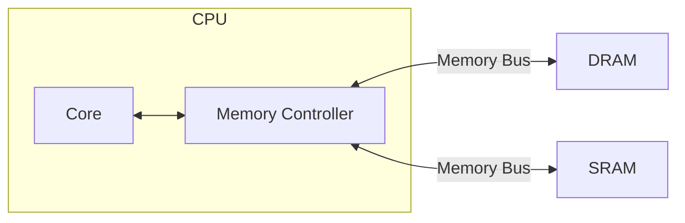

# Machine Architecture Emulator

This is a crude emulator of a standard machine architecture. It is a toy machine with a toy CPU as a means to explore computer architecture. 

## Architecture

## Current Features

- CPU
  - Cache
  - Stack
- Rudimentary ISA
  - add
  - sub
  - mov
  - cmp
  - jmp
  - jeq
  - jne
  - psh
  - pop
  - end
  - cal
  - ret
  - Labels
- DRAM
- SRAM
- Assembler
  - Tokenizer / Lexer
  - Two-Pass Assembler
- Disassembler
- Basic Telemetry

## Planned Features

- Virtual Memory / MMU
