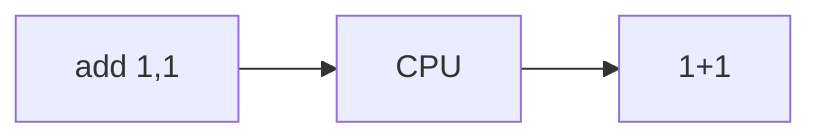
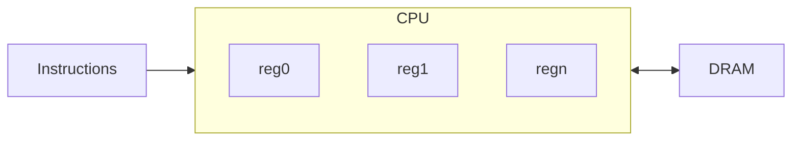

# Dev Log 0: The Basics

Ok, so we want to create a CPU emulator. The goal of this project will be to more deeply understand the architecture of modern CPUs, the tradeoffs they make, and the complexities behind the abstractions. Let's get started.

## Where do we start?

So where do we start? Well, we should probably start with the CPU, the central processing unit. Most people are probably familiar with these, at least a bit. Maybe you remember from university, maybe from building your own PC, or any number of other areas.

Yeah, we will need a CPU. This will be the heart of our emulator. It will be the "entry point" for executing anything.

## The CPU

### Instructions

What is the goal of the CPU? The CPU executes the instructions, which is the entire point of a computer right? So we will need to design our own instruction set. Think x86 or ARM ISA (instruction set architecture). This represents the list of valid instructions that our CPU will be capable of executing.



For now, let's support some very basic operations. These will be:
- `add`: Add two numbers 
- `sub`: Subtract two numbers
- `mov`: Move one number into something

### Operands

Next, we will need to define how our operands will work. These are the "arguments" to the instructions we support.

Generally, CPUs come with registers, which are super fast built in pieces of storage for operating on values. We will want to support these. They will be addressed with raw numbers (for now) instead of common names like `rax`, `rbx`, etc.

The syntax for these will be something like:

```asm
$0 // Register 0
$1 // Register 1
```

We will of course also want to support literal numbers. These will be numbers without a prefixed `$`.

So, lets put together our first little program:

```asm
mov $0,0
add $0,1
add $0,1
sub $0,1
```

Do you know what the value of register 0 will be after this program runs?

It will be 1. Thats because we first move a value of 0 into `$0`, then add 1 to `$0` twice, and finally subtract 1 from `$0`.

## Memory

We also want to support some kind of main memory. For us, we will choose to support a kind of DRAM. Things get complicated now though, because this means we need to support a form of addressing. For our simple purposes, lets just use an address size of a single byte, and let's say that our memory is addressable by byte. That means that our addresses are one byte long and point to a value that is also one byte long.

Do you know how many bytes of memory we can support with this setup?

We can support up to 256 bytes of working memory. This is because our address space is one byte long, which can hold up to 256 addresses. Since each address corresponds to a single byte, we can support up to `256 * 1` bytes of memory!

What we are supporting (for now) is physically addressed memory. This is similar to "real mode" in x86 CPUs. The CPU can read and write to memory using a real, physical address. Later on we may add support for virtual addressing, but we will go over that if and when that happens.

We also need some kind of syntax for accessing real memory. Let's just copy our C syntax, and use the `*` operator.

Lets augment our previous little program to instead use our new memory!

```asm
mov *0,0
add *0,1
add *0,1
sub *0,1
```

See what we did there? Instead of using `$` to refer to a register, we are using `*` to refer to an address. One of the goals of this project is to better understand the tradeoffs and reasons behind computer architecture. We have registers in our CPUs for a reason! Accessing main memory is expensive, and we are doing it 4 times. How do you think we could improve our little program to minimize the number of times we need to access main memory?

What if we stored our value in a register and performed our operations on the register, and only wrote to memory when we were done?

```asm
mov $0,0
add $0,1
add $0,1
sub $0,1
mov *0,$0
```

Here, we added one more instruction, but now we only access main memory once! This is much faster, in the ballpark of 75% faster!

So that will be our syntax for memory access, but we could also combine it with our syntax for registers:

```asm
mov $0,5
mov *$0,0
add *$0,1
```

Here we move the address 5 into register `$0`, then move the value 0 into the memory at address 5, then finally add 1 to the value at address 5.

So, when we combine `*` and `$` into `*$` that means "the memory at the address in register n".

## Overview

Alright, so we have created:



We have also defined our syntax for our basic assembly language. In the next devlog, we will explore some code implementations.

[Next DevLog](./log1_cache.md)
