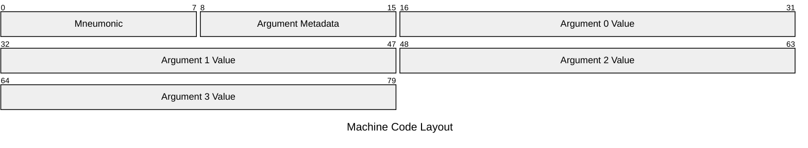

# Dev Log 4: SRAM

This one is a bit of a journey.

My next goal is going to be to support conditional and jumping instrucitons in our toy assembly language. This will support more complicated logic. I have a pipe dream of creating a subset C compiler that will be capable of compiling extremely basic subset of C code to our assembly, and of course conditionals and jumps will be pretty important for that.

Conditionals would be easy enough to implement, just expand with a status register and store the results of our comparisons there. Jump instructions would be much more difficult though. We would need the ability to express *where* to jump! We don't really have that right now...

Right now, we gather the instructions from a plaintext file, parse them into a type, and store a vector of them. Then we just iterate over that vector to execute them incrementally. We *could* express jumps as a relative number of instructions and track that through the vector, but that's no fun is it?

In real hardware, instructions aren't fed in in plaintext, they exist inside of the memory of the system! They have addresses and occupy bytes and can technically be modified!

Let's do that instead.

## Design

Alright, so we need to support instructions within the memory space of the machine. There's a few problems we need to solve here.

- Assembling
- Disassembling
- Storage

We will go over them one by one.

### Assembling

As mentioned before, we are currently feeding plaintext assembly to the program which parses it directly. This can't continue. We need to "assemble" the program, which means to take the plaintext assembly language and convert it to binary machine code representation. This is sometimes referred to as "compiling" but pedantically speaking, compiling refers to higher level languages to machine code. Assembly represents machine code 1:1 and its conversion is called assembling.

We need to come up with a binary layout for our instructions. First lets think about what information we need to encode.

- Instruction (mneumonic)
- Value of the arguments
- Metadata of the arguments

So, for example, take our add instruction:

```asm
add $r0,4
```

This breaks down into:

- Instruction: `add`
- Value of the arguments:
  - First Argument: Some binary representation of `$r0`
  - Second Arugment: `4`
- Metadata of the arguments:
  - First Argument: Register, No Deref
  - Second Argument: Literal, No Deref

Let's start with the binary representation of registers. This is as simple as grabbing the discriminant of the different `Register` enum variant. There are only a handful of registers at the moment, but it will grow. Despite that, I think it is unlikely the number of registers we support grows beyond 256, so technically this could fit in a single byte. However, for simplicity (for now) we will allocate two bytes for the representation of a register.

We will also take two bytes for a literal, as literals are `Word`s which after our last devlog, is now a `u16` or two bytes.

Our instruction can be similarly represented in binary by taking the discriminant of an enum. We only support a handful of instructions (called mneumonics) and it is also unlikely this will exceed 256. Since we don't have any other thing to match, we will take a single byte to represent the mneumonic.

That leaves finally our argument metadata. Currently, all of our instructions accept two arguments. This is not necessary and will not be the case in the future! When we add a jump instruction, it'll only take an address. If we ever support a `ret` instruciton, it might take none at all.

There are two boolean properties of an argument we need to represent: whether it is a register or literal, and whether it is dereferenced or not. This can be stored in two bits. We have up to two arguments right now, but may have more in the future. For now, we will allocate a single byte to represent the metadata, which will allow us up to four arugments.

The layout will look like:

| Bit | Description    |
| --- | -------------- |
| 0   | Arg 0 Deref    |
| 1   | Arg 0 Register |
| 2   | Arg 1 Deref    |
| 3   | Arg 2 Register |
| 4   | Arg 3 Deref    |
| 5   | Arg 3 Register |
| 6   | Arg 4 Deref    |
| 7   | Arg 4 Register |

The number of arguments is hardcoded per mneumonic, so it does not need to be encoded in the metadata, it will be expected from the value of the mneumonic. This will determine which bits here are actually valid and should be read.

Let's put it all together.



With each argument being optional depending on the mneumonic operation.

Alright, we have a good idea of what the end goal is. Now let's figure out an API.

We will create a method on the `Operation` enum:

```rust
pub fn compile(self) -> Vec<u8>;
```

Which will spit out the compiled bytes. I know I am contradicting the pedantry I had before around compiling and assembling, too bad!

We could implement this manually easily enough, but remember, this is only the beginning, there are many more instructions to come! Do we really want to update all this code manually every time we add an instruction? That will also get increasingly more error prone.

Also, it's important to remember that we are not coding in C anymore, we're in Rust, with a fully featured and robust macro system. Let's use that...

This devlog would be too long to go through and explain how Rust's macros work, but the TL;DR is we will iterate over the variants of the enum, create general intermediate types, destructure the variants into these intermediate types, compile them, then put them together into our output vector.

### Disassembling

Disassembling will be mostly done in that we just have to do assembling, but backwards. The only real problem to solve here is API design. I think that since we don't want to relinquish ownership of the data to the method, instead we should accept some kind of reference or iterator. I am leaning towards an iterator, as this will allow us a lot of flexibility around implementation inside of the emulator.

```rust
pub fn consume(bytes: &mut impl Iterator<Item = u8>) -> Result<Option<Operation>>;
```

This will be implemented as a static method of `Operation` enum. This gives us flexibility on how we call/use this API. Taking a look at the return type, `Err` will represent an invalid instruction. An `Ok(None)` will represent the end of the iterator being hit at an acceptable point (when trying to read beginning mneumonic byte). Finally, an `Ok(Some(op))` obviously will represent a valid operation being interpreted.

We need to integrate this into the emulator. To do this, we will have two points where we can consume. We have the "live" consuming that occurs when reading the next instruction and we will have a sideband consuming when we want to interpret the current and a couple next instructions for use in the debugging output.

We will track where the next instruction is located with a new `$IP` register. It will hold the address to the next instruction in memory.

We will create two new iterator types, one for the in-band instruciton reading and one for the side-band instruction reading.

These will be `IpIter` and `InertIpIter`.

`IpIter` will modify `$IP` within the CPU as it iterates through the bytes, and `InertIpIter` willl initialize from `$IP` but track its iteration with an internal copy of `$IP` so as to not modify the CPU it was spawned from.

### Storage

Finally, that brings us to how we will actually store this assembled machine code. I kind of spoiled it before if you were reading closely, but we will store them in the address space of the machine.

Instead of directly in DRAM, we will store it in a new kind of memory, SRAM.

This means we need to greatly expand the functionality of the `MemoryController` struct, which will now allow for registration of new memory regions in the physical address space.

This will allow us to register the DRAM in one physical address space, and the SRAM in another. Then, we can access either in the exact same way by just accessing addresses in either range through the memory controller. Then, when we initialize the CPU and registers, we can initialize the `$IP` register to the beginning of the SRAM address space.

We will do this with traits. Let's design our trait!

```rust
pub trait MemoryFabricEndpoint {
    fn id(&self) -> Option<String>;
    fn region(&self) -> MemoryRegion;
    fn read_byte(&self, addr: PhysAddr) -> u8;
    fn write_byte(&mut self, addr: PhysAddr, val: u8);
    fn kill(self);
}
```

Alright, all of the methods are fairly self explanatory, but the `id()` method will return an optional self identification for use in debugging and displaying.

The `region()` method will return a `MemoryRegion` specification describing the memory region that this endpoint supports.

The `read_byte()` method will read a single byte at any address (must be within the memory region).

The `write_byte()` method will write a single byte to any address (must be within the memory region).

`kill()` is just a cleanup method.

This defines the different things that the `MemoryController` may do with one of it's registered endpoints.

[Next DevLog](./log5_jmp.md)
