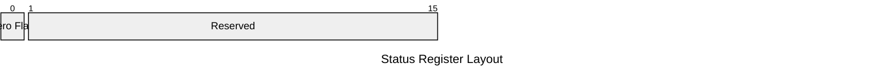

# Dev Log 6: Conditionals

One of the most important primitive functions of a CPU is the ability to *branch* between different code paths. One way this can be done is through conditionals. That is what we will implement here.

## Design

First we need to come up with a pattern for our conditionals. The way we are going to do things is there will be a `cmp` instruction, which can be followed by a `jeq` or `jne` instruction that will jump to a given address if the previous comparison was equal or not equal, respectively.

This means that we will need some way to store the result of the comparison between instructions. For that we will use a CPU status register. This will be full of flags for the status or settings of the CPU. For now, we are only going to care about one flag, the zero flag. This will be true if the result of the last operation was 0. Our `cmp` instruction will set this flag, and then our `jne` and `jeq` instructions can examine it to conditionally jump.

Technically, this also means that the following instruction sequences will function the same from a control flow perspective:

```asm
mov $r0,5
cmp $r0,5
jeq EQUAL
// If not equal, set $r0 to 0
mov $r0,0
jmp END

// If equal, set $r0 to 1
EQUAL:
mov $r0,1

END:
```

```asm
mov $r0,5
sub $r0,5
jeq EQUAL
// If not equal, set $r0 to 0
mov $r0,0
jmp END

// If equal, set $r0 to 1
EQUAL:
mov $r0,1

END:
```

They are similar in that both `cmp $r0,5` and `sub $r0,5` will set the zero bit in the status register however they differ in that `sub $r0,5` will also modify the value in `$r0`. It is generally preferred to use `cmp` when conditionally jumping, but there may be cases where another arithmatic operation may be more suitable.

The other thing we will need to define is the status register. As mentioned before, for now we only care about the zero flag. In the future we may (will) add more flags.

Here is what that register will look like (for now):



[Next DevLog](./log7_the_stack.md)
